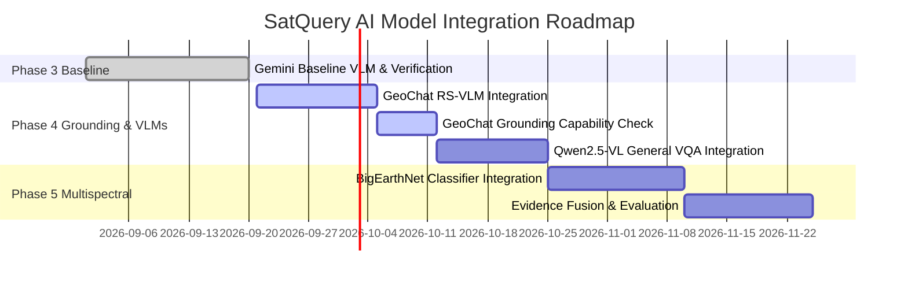

# Model Integration Roadmap — SatQuery AI

**Author**: Member 3 (AI/ML Lead)  
**Date**: September 20, 2026  
**Status**: APPROVED ARCHITECTURE ROADMAP  
**Repository Branch**: `feature/member3-ai-ml-training`

---

## 1. Executive Summary

SatQuery AI employs a modular, two-lane architecture (Lane A: Deterministic Scientific Measurements, Lane B: Vision-Language Model Reasoning, Lane C: Fact-Checking Verification).

To ensure high accuracy and avoid over-promising model capabilities, model integration follows a strict, step-by-step sequence. Candidate models must NOT be listed as operational until their individual adapters, environment variables, device selection, weights checkpointing, and inference tests are fully verified.

---

## 2. Detailed Integration Sequence

---

## 3. Phase-by-Phase Roadmap

### PHASE 4: Spatial Grounding & VLM Integration

#### Step 1: GeoChat RS-VLM Integration (First Priority for RS-VQA)
- **Primary Task**: Single-image Remote Sensing VQA, aerial image captioning, region-based reasoning.
- **Why First?**: GeoChat (7B, CVPR 2024) is domain-adapted on 318k remote-sensing instruction pairs, making it highly specialized for satellite and aerial VQA.
- **Verification Protocol**:
  1. Setup local PyTorch inference endpoint or vLLM container (`GEOCHAT_ENDPOINT_URL` or `GEOCHAT_WEIGHTS_PATH`).
  2. Implement `GeoChatAdapter(BaseVLMAdapter, BaseGroundingAdapter)`.
  3. Verify whether the selected GeoChat checkpoint reliably outputs valid spatial region tokens.
  4. Enable bounding box grounding ONLY if spatial region tokens pass coordinate validation without hallucination.

#### Step 2: Qwen2.5-VL Integration (Second Priority for General VQA)
- **Primary Task**: Dynamic-resolution general VQA, multi-frame reasoning, high-resolution document/chart understanding.
- **Why Second?**: Qwen2.5-VL provides state-of-the-art general visual comprehension and native absolute pixel bounding box output (`[x1, y1, x2, y2]`).
- **Verification Protocol**:
  1. Configure `QWEN_ENDPOINT_URL` (vLLM / Ollama server).
  2. Implement `Qwen25VLAdapter(BaseVLMAdapter, BaseGroundingAdapter)`.
  3. Benchmark inference throughput on GPU (4-bit AWQ / FP16).
  4. Verify pixel coordinate scaling against image width/height.

---

### PHASE 5: Multispectral Classifier & Evidence Fusion

#### Step 3: BigEarthNet Pretrained Classifier Integration
- **Primary Task**: Quantitative 19-class CORINE multi-label land-cover prediction on Sentinel-1 SAR and Sentinel-2 optical multi-band rasters.
- **Architecture**: Placed in `backend/ai/classifiers/BigEarthNetClassifier` (`BaseRSClassifier`), separate from generative VLMs.
- **Verification Protocol**:
  1. Validate real BigEarthNet-MM / reBEN Sentinel patch samples (`.npy` multi-band tensors).
  2. Verify 12-band optical and 2-band SAR channel ordering and normalization scaling (0.0 to 1.0 / dB conversion).
  3. Load PyTorch model weights checkpoint (`BIGEARTHNET_CHECKPOINT_PATH`).
  4. Generate multi-label probability vectors.
  5. Feed classifier predictions into `ScientificEvidence` (`Lane A`).

#### Step 4: Evidence Fusion & Benchmark Evaluation
- **Primary Task**: Connect `ScientificEvidence` output to Lane B VLM prompts and evaluate system accuracy.
- **Verification Protocol**:
  1. Inject BigEarthNet land-cover predictions and scientific spectral indices (NDVI, NDWI) into `EVIDENCE_AWARE_VQA_PROMPT`.
  2. Execute `EvaluationEngine` benchmark on real remote-sensing evaluation datasets (RSVQA, UCMerced-Captions, BigEarthNet).
  3. Report Exact Match, token Jaccard similarity, and evidence consistency metrics.

---

## 4. Configuration & Deployment Matrix

| Model Identifier | Provider Key | Env Var Config | Execution Type | Hardware / Memory Req |
| :--- | :--- | :--- | :--- | :--- |
| `gemini-vlm` | `gemini` | `GEMINI_API_KEY` | Cloud API | 0 GB (External API) |
| `geochat-7b` | `geochat` | `GEOCHAT_ENDPOINT_URL`, `GEOCHAT_WEIGHTS_PATH` | Local Weights / Server | ~16 GB (FP16) / ~7 GB (4-bit) |
| `qwen2.5-vl-7b` | `qwen` | `QWEN_ENDPOINT_URL` | Local vLLM Server | ~16 GB (FP16) / ~8 GB (4-bit) |
| `bigearthnet-resnet50` | `bigearthnet` | `BIGEARTHNET_CHECKPOINT_PATH`, `BIGEARTHNET_DEVICE` | Local PyTorch Weights | ~2-4 GB (GPU/CPU) |

---

## 5. Strict Operational Rules

1. **Lazy Loading**: Models must NOT load weights or bind GPU memory at application startup. Loading must occur on-demand upon first inference request.
2. **Environment Control**: Model selection must be fully controllable via environment variables (`ACTIVE_VLM_PROVIDER`, `ACTIVE_CLASSIFIER`).
3. **Graceful Fallbacks**: If a configured model is unavailable or encounters GPU out-of-memory errors, the system must return a structured error response (`is_error=True`, `error_code="..."`) without crashing the application server.
4. **Honest Capabilities**: A model is strictly marked as `CANDIDATE` or `PLANNED` until its adapter and live inference tests pass.
