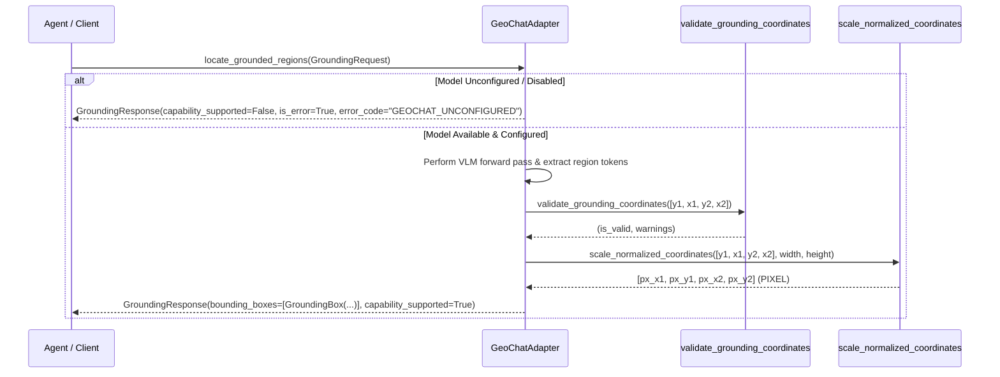

# Phase 4 Grounding Implementation — SatQuery AI

**Author**: Member 3 (AI/ML Lead)  
**Date**: September 20, 2026  
**Status**: ARCHITECTURE PREPARED & SCHEMAS TESTED  
**Repository Branch**: `feature/member3-ai-ml-training`

---

## 1. Grounding Design Principles

Spatial object grounding maps text queries (e.g., "locate solar panels", "detect water reservoirs") to spatial bounding box coordinates over satellite imagery.

### Core Principles:
1. **Strict Anti-Hallucination Gate**: The system must NOT invent bounding box coordinates or convert plain text descriptions into fake coordinates.
2. **Provider-Independent Schemas**: Grounding requests and responses use standardized Pydantic schemas in `backend/ai/grounding_interface.py`.
3. **Coordinate Convention Normalization**: Dynamic conversion between token integer ranges (`NORMALIZED_1000`), normalized floats (`NORMALIZED_1`), absolute pixels (`PIXEL`), and geographic coordinates (`GEO_COORDINATE`).
4. **Unsupported Model Fallbacks**: If a model does not support native spatial bounding box generation, it returns `capability_supported=False` with `error_code="GROUNDING_UNSUPPORTED"`.

---

## 2. GeoChat Spatial Grounding Integration

GeoChat uses region tokens (e.g., `[y1, x1, y2, x2]` in `NORMALIZED_1000` convention) to indicate localized targets.

---

## 3. Unit Test Verification

- `backend/tests/test_grounding_interface.py` (6 tests passed):
  - Bounding box schema validation (`GroundingBox`).
  - Degenerate box detection (`x2 <= x1` or `y2 <= y1`).
  - `NORMALIZED_1000` to `PIXEL` scaling helper verification.
  - Unsupported capability responses for non-grounding models.
